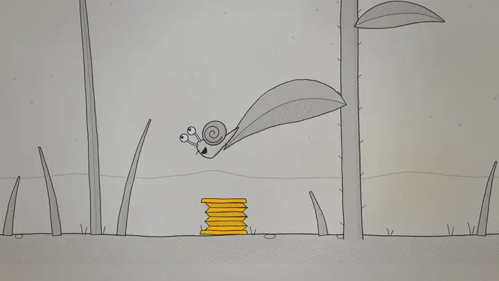

# Horon

[](https://www.python.org/)
[](LICENSE)
[](.agents/skills/horon-cli/SKILL.md)

> **让 AI 把吃过的亏，搭成会拦住自己的红石电路。**

<table>
<tr>
<td width="50%"></td>
<td width="50%"></td>
</tr>
<tr>
<td>AI 记下了教训，下次照样犯。</td>
<td>给 AI 一套红石：让它自己学会拼装记忆、思路和刹车。</td>
</tr>
</table>

> [!WARNING]
> **Horon 还在开发早期。** 更新后可能会破坏已有数据，你的 AI 以前搭好的电路也可能因此失效。

---

## 它能搭什么

- **自适应记忆**：像短视频算法推荐一样，Horon 会学习 AI 翻阅记忆的习惯。当它阅读 A，系统自动把下一步最可能用到的几条记忆递到眼前。
- **自动化电路**：像连锁机关一样，把「做完 A 才能做 B」「看到 X 就提醒自己」连成自动触发的流转规则。
- **物理刹车**：前置条件不满足时，在工具执行前直接卡死拦截，并告诉 AI 还差哪一步。
- **可复用模式（Tag 插件）**：像工业模具一样，把一类事情的“正确做法”写成插件，新任务挂上标签，就自动受这套做法约束。

## 看看效果

1. **当场抓包口头答应**：  
   AI 在对话里满口答应「好的我记下了」，实际上根本没调工具写库。Horon 当场拦截并报错：*“你说记下了，但这一轮什么都没写。”*

2. **邮件回复流水线**：  
   - 供应商小林发来一封日常确认邮件，系统触发传感器，弹出提醒：*“【Horon Harness】收到小林的来信。请阅读「给小林写邮件的指导」（ID 482），然后撰写回信。”*
   - AI 没读就想直接调 `send_email` 发送？**直接拦截**。
   - 读完再发？系统自动跑一遍检查：有无「值得注意的是」这类 AI 套话？收件人对不对？全合格才通电放行。

3. **公网发帖防踩雷**：  
   - AI 自主在社交平台发帖或回复，草稿里不小心夹带了真实姓名、私聊记录或 API Key。
   - 发送工具在执行前**直接切断**：*“检测到敏感隐私信息，禁止对外发送。”*

把需求告诉你的 AI，让它照着 Horon 的说明书（skill）把这些机关搭出来。

## 安装

不用你自己动手。把下面这段话发给你的 AI：

```text
请帮我安装 Horon：阅读 https://github.com/Dataojitori/horon/blob/master/docs/INSTALL.md 并照做。
```

支持 **Claude Code**、**Codex**、**Antigravity**。

## 给 AI 看的说明书

- [horon-cli](.agents/skills/horon-cli/SKILL.md)：Horon 的基础使用说明
- [horon-plugin](.agents/skills/horon-plugin/SKILL.md)：Tag 插件的制作说明

## 可视化控制台

Horon 带一个网页控制台，可以看到整张记忆图、哪些电路正在通电，以及记忆之间是怎么联想的。启动方法见 [INSTALL.md](docs/INSTALL.md#可选可视化控制台)。

## 协议

Apache-2.0，附加一条署名条件：用在面向组织外部用户的产品或服务里时，请标注「This product uses Horon」并附上本仓库链接。只在内部使用不受此限。详见 [LICENSE](LICENSE)。
